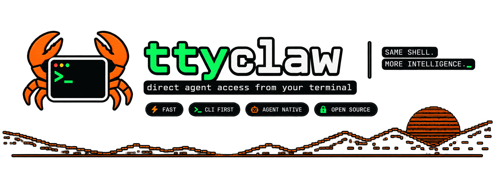

<p align="center">
  
</p>

# ttyclaw

**direct agent access from your terminal**

`ttyclaw` passes a prompt to `openclaw agent` and prints the agent's answer. It is a small Bash wrapper, not a separate client or configuration system.

```text
$ ttyclaw --agent jarvis look for pdf files in this folder
```


## Communication

| Direction | Flow |
| --- | --- |
| *Question* | You → the terminal of your choice → ttyclaw → openclaw → LLM  |
| *Answer* | LLM → openclaw → ttyclaw → terminal → You |


## Requirements

- Bash
- [`openclaw`](https://github.com/openclaw/openclaw) CLI, authenticated and otherwise configured as required by your OpenClaw setup
- [`jq`](https://jqlang.org/) for plain-text output

`ttyclaw` looks for `openclaw` on `PATH`. Set `OPENCLAW_BIN` when it lives elsewhere.

## Install

```bash
git clone https://github.com/MNLBCK/ttyclaw.git
cd ttyclaw
./install.sh
```

### What does the installation script do?

It creates `~/.local/bin/ttyclaw` as a symlink to this checkout. Add that directory to `PATH` if it is not already there:

```bash
export PATH="$HOME/.local/bin:$PATH"
```

Put the export in your shell profile to keep it after restarting the shell. To use another directory, pass it explicitly:

```bash
./install.sh --bin-dir "$HOME/.npm-global/bin"
```

The installer never replaces an existing `ttyclaw`; remove or rename it yourself if that is intentional.

It asks for a preferred agent (for example, `jarvis`) and stores the answer in `~/.config/ttyclaw/agent`. Leave it blank to use `main`.
For a non-interactive install, provide it directly:

```bash
./install.sh --agent jarvis
```

## Usage

### Simple examples

```bash
ttyclaw summarize this repository
```

```bash
ttyclaw --agent researcher "find risks in this architecture"
```

```bash
ttyclaw --session-key review-42 "review the current change"
```

Notes:

- Prompts without shell-special characters need no quotation marks.
- Quote prompts containing characters such as `?`, `*`, `$`, `!`, `|`, `>` or `&`, because the shell otherwise interprets them.
- Quoting is especially needed for a question mark in interactive zsh.

### Use your agent's name, e.g. `jarvis`

Select it for one command:

```bash
ttyclaw --agent jarvis "what should I work on next?"
```

Or make it the ttyclaw default:

```bash
./install.sh --agent jarvis
ttyclaw "what should I work on next?"
```

`TTYCLAW_AGENT=jarvis` sets a per-shell default and takes precedence over the saved choice. An explicit `--agent` option still wins over both.

**Pro tip**: you can add an alias like `alias jarvis='ttyclaw --agent jarvis'` to your `.zshrc`.


### Extended examples with context

Standard input is appended to the prompt, so it works naturally in pipelines:

```bash
git diff | ttyclaw --agent reviewer "review this"
docker logs my-app | ttyclaw "what broke?"
npm test 2>&1 | ttyclaw "why is this failing?"
```

Use `--json` to print OpenClaw's raw JSON response instead of extracting the visible answer:

```bash
ttyclaw --json "inspect the current repository"
```

In an interactive terminal, ttyclaw repeats the first two lines of the prompt
in cyan and prints the answer in green. Output stays uncoloured when piped or
redirected.

## Options and environment

| Option | Description | Environment variable | Default |
| --- | --- | --- | --- |
| `--agent <id>` | Agent id | `TTYCLAW_AGENT` | `main` |
| `--session-key <key>` | Persistent session key | `TTYCLAW_SESSION_KEY` | `terminal` |
| `--model <id>` | Model override for this run | `TTYCLAW_MODEL` | — |
| `--thinking <level>` | Thinking level passed to OpenClaw | `TTYCLAW_THINKING` | — |
| `--local` | Run the embedded agent locally | `TTYCLAW_LOCAL=1` | — |
| `--json` | Print raw OpenClaw JSON | `TTYCLAW_JSON=1` | — |

`OPENCLAW_BIN=/path/to/openclaw` can be used to specify the path to the
`openclaw` executable.

Run `ttyclaw --help` for the built-in reference.
